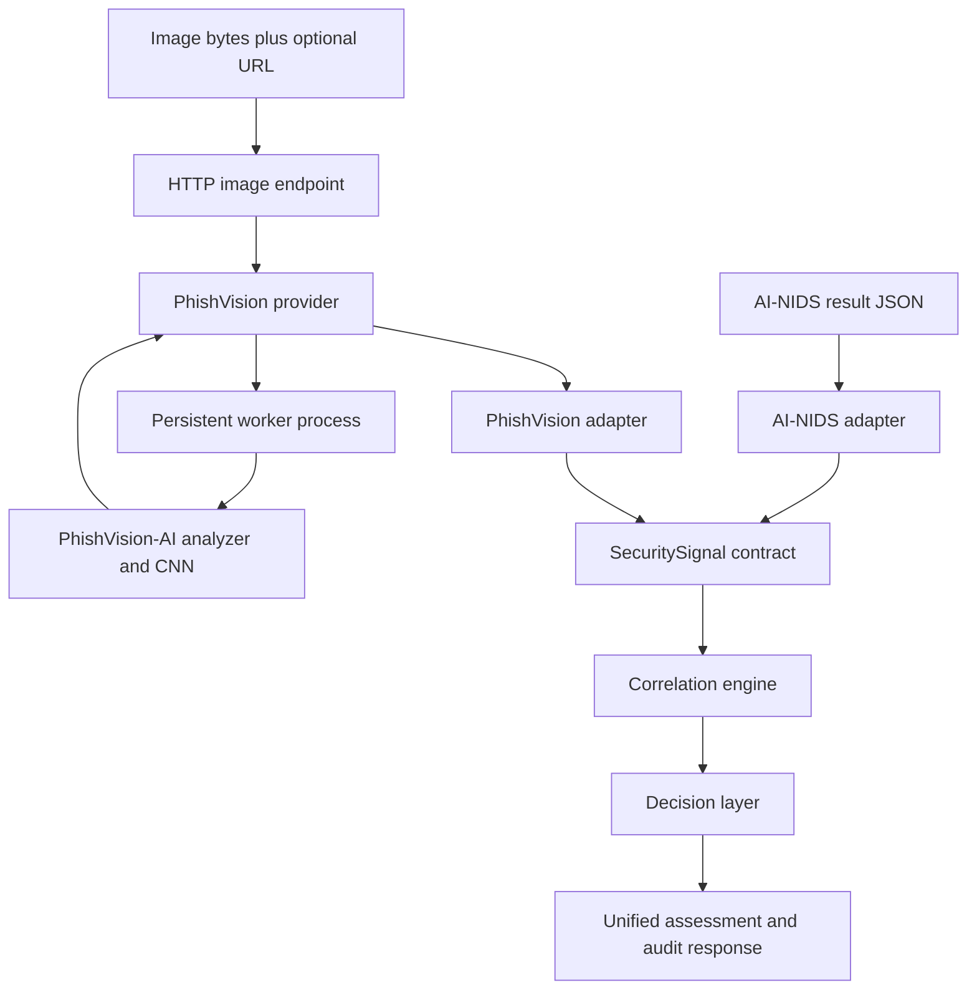

# Unified Cybersecurity Platform

A security orchestration platform that normalizes and correlates cybersecurity signals from **AI-NIDS** and **PhishVision-AI** into an explainable assessment, operational recommendation, and audit record.

The unified project is deliberately separate from both detector repositories. It contains the integration layer and does not modify either source project's production behavior.

## Status

- **PhishVision image inference:** integrated through an isolated, persistent worker process.
- **AI-NIDS:** supported through normalized ingestion of an already-produced result; this API does not start AI-NIDS live inference or network capture.
- **Unified assessment:** component signal normalization, severity correlation, decision recommendations, evidence aggregation, and audit metadata.
- **Operator UI:** served by the local API application.

This is a local development and portfolio project, not an automated enforcement system. Recommendations such as `investigate` or `monitor` do not themselves block traffic or modify external systems.

## Architecture



The image provider launches the configured Python interpreter from the separate PhishVision-AI environment. A worker loads the analyzer once, exchanges bounded JSON-line messages with the platform, and is closed during normal API shutdown. Worker output on standard output is reserved for the protocol; diagnostic output is kept on standard error.

## Features

- **Normalized signals:** a shared `SecuritySignal` contract preserves source, signal type, status, score semantics, normalized score, severity, evidence, metadata, and timestamp.
- **Component-level phishing signals:** text/OCR, URL, and visual CNN results are adapted as separate signals.
- **Evidence-aware severity:** existing severity findings take precedence; categorical analyzer outputs provide conservative fallback severity when findings are absent.
- **Explainable correlation:** combines available component signals, calculates overall severity and primary threat, aggregates evidence, and records cross-source corroboration.
- **Fail-safe decisions:** unavailable or failed components are not treated as benign. An unknown assessment defaults to investigation and human review.
- **Worker isolation:** a separate process boundary with startup/request timeouts, output limits, protocol validation, and worker restart behavior.
- **Request validation:** body-size limits, allowed image media types, bounded query fields, and image decoding/dimension/pixel validation.
- **Auditability:** responses include event identity, component statuses, final severity, recommended action, and human-review state.

## Requirements

- Python 3.11 or newer is recommended.
- A local checkout of [PhishVision-AI](https://github.com/Rubayat0007/PhishVision-AI) with its own working virtual environment, model, and dependencies.
- PowerShell on Windows for the commands below; equivalent environment-variable and shell syntax can be used on other operating systems.

The unified API and PhishVision-AI are separate Python environments. Install web/API dependencies for the unified project and configure the PhishVision worker to use the interpreter from the PhishVision-AI environment.

## Local setup (Windows PowerShell)

### 1. Install the unified API dependencies

From the repository root:

```powershell
python -m venv .venv
.\.venv\Scripts\python.exe -m pip install --upgrade pip
.\.venv\Scripts\python.exe -m pip install fastapi uvicorn httpx
```

If this checkout includes a maintained dependency manifest, prefer installing from that manifest instead of managing direct dependencies manually.

### 2. Configure the PhishVision runtime

Set these environment variables in the terminal that will run the API. Replace the paths if your PhishVision-AI checkout is somewhere else.

```powershell
$env:UCP_PHISHVISION_PYTHON = "C:\path\to\PhishVision-AI\.venv\Scripts\python.exe"
$env:UCP_PHISHVISION_ROOT = "C:\path\to\PhishVision-AI"
```

`UCP_PHISHVISION_PYTHON` must point to the PhishVision-AI Python interpreter that can import its installed dependencies and load the model. `UCP_PHISHVISION_ROOT` must point to the PhishVision-AI repository root containing `src/security/analyzer.py`.

Optional configuration:

| Variable | Default | Purpose |
|---|---:|---|
| `UCP_MAX_REQUEST_BYTES` | `1048576` (1 MiB) | Maximum body size for ordinary API requests. |
| `UCP_MAX_IMAGE_REQUEST_BYTES` | `10485760` (10 MiB) | Maximum raw image request size. The worker also respects the PhishVision source project's own upload cap. |
| `UCP_PROVIDER_TIMEOUT_SECONDS` | `30` | Per-request provider worker timeout. |
| `UCP_PROVIDER_MAX_OUTPUT_BYTES` | `1048576` (1 MiB) | Maximum accepted worker output line and retained stderr tail. |
| `UCP_PHISHVISION_ENABLED` | `true` | Enables or disables image-provider requests. |
| `UCP_AI_NIDS_ENABLED` | `true` | Component setting; does not enable live AI-NIDS inference by itself. |

Settings are read when the API process starts. Restart the API after changing environment variables.

### 3. Start the API

```powershell
python -m uvicorn api.app:app --host 127.0.0.1 --port 8000 --log-level info
```

The API binds to loopback for local development. Keep the terminal open while using the application. The PhishVision worker is initialized lazily when an image assessment is first requested.

### 4. Open the application

- Dashboard: <http://127.0.0.1:8000/>
- Interactive API documentation: <http://127.0.0.1:8000/docs>
- Health: <http://127.0.0.1:8000/health>
- Readiness: <http://127.0.0.1:8000/ready>
- OpenAPI schema: <http://127.0.0.1:8000/openapi.json>

## API reference

### `POST /v1/assess/image`

Runs the actual PhishVision analyzer on an uploaded screenshot and passes its component signals through the unified correlation and decision pipeline.

**Request format**

- Body: raw image bytes (not multipart form data).
- Supported `Content-Type` values: `image/jpeg`, `image/png`, and `image/webp`.
- Optional query parameter `url`: URL to analyze alongside the image (maximum 2,048 characters).
- Optional query parameter `event_id`: caller-provided event ID (maximum 128 characters).
- Maximum request size: configured by `UCP_MAX_IMAGE_REQUEST_BYTES`, subject to the PhishVision source project's own upload limit.

**PowerShell example**

Replace the sample path and URL with the screenshot and URL you want to assess:

```powershell
$imagePath = "C:\path\to\screenshot.png"
$imageBytes = [System.IO.File]::ReadAllBytes($imagePath)

$result = Invoke-RestMethod `
    -Uri "http://127.0.0.1:8000/v1/assess/image?event_id=evt-demo-001&url=https%3A%2F%2Fexample.com" `
    -Method Post `
    -ContentType "image/png" `
    -Body $imageBytes

$result | ConvertTo-Json -Depth 20
```

The response uses the unified assessment schema, including `assessment`, `decision`, and `audit`. Check `assessment.component_status.phishvision` to see whether PhishVision inference was available. A provider failure is represented by explicit error signals and a fail-safe decision; malformed or oversized image requests receive an HTTP client error.

Typical HTTP validation responses:

| Status | Meaning |
|---|---|
| `413` | Request exceeds the configured size limit. |
| `415` | Unsupported image media type. |
| `422` | Empty or invalid image request, or invalid query parameters. |

### `POST /v1/assess`

Accepts already-produced subsystem results as JSON and runs the same unified orchestration pipeline. This is the ingestion endpoint for fixture-based or externally produced results; it does not launch either detector's model by itself.

Example using the checked-in fixtures:

```powershell
$nids = Get-Content .\fixtures\ai_nids\high_attack.json -Raw | ConvertFrom-Json
$phishvision = Get-Content .\fixtures\phishvision\high_phishing.json -Raw | ConvertFrom-Json

$body = @{
    event_id = "evt-fixture-001"
    ai_nids_result = $nids
    phishvision_result = $phishvision
} | ConvertTo-Json -Depth 30

$result = Invoke-RestMethod `
    -Uri "http://127.0.0.1:8000/v1/assess" `
    -Method Post `
    -ContentType "application/json" `
    -Body $body

$result | ConvertTo-Json -Depth 20
```

### `GET /health` and `GET /ready`

`/health` reports whether the API process responds. `/ready` reports component/readiness information. Readiness does not mean that live AI-NIDS inference is connected.

## Signal, severity, and decision policy

`SecuritySignal` keeps raw-score meaning explicit; scores from different detectors are not assumed to be directly comparable probabilities. The correlation policy uses the highest severity among available signals and derives threat categories from signals at `SUSPICIOUS` or above.

| Severity | Default action |
|---|---|
| `CRITICAL` | `INVESTIGATE` |
| `HIGH` | `INVESTIGATE` |
| `SUSPICIOUS` | `WARN` |
| `MEDIUM` | `WARN` |
| `LOW` | `MONITOR` |
| `MINIMAL` | `ALLOW` |
| `UNKNOWN` | `INVESTIGATE` |

Unavailable signals are not automatically benign. When no usable severity is present, the final assessment remains `UNKNOWN` and defaults to investigation rather than assuming safety. High and unknown assessments can require human review.

## Testing and validation

Run from the repository root:

```powershell
python -m unittest discover -s tests\unit -p "test_*.py" -v
python -m unittest discover -s tests\integration -p "test_*.py" -v
python -m compileall api core adapters
git diff --check
```

The tests cover contracts, adapters, severity/correlation policy, operational decisions, provider and worker lifecycle, request limits, error handling, HTTP endpoints, and dashboard serving. The live PhishVision inference path has also been manually verified with a phishing image and a legitimate image; model results may differ for other inputs.

## Repository structure

```text
adapters/
  ai_nids/                 AI-NIDS result adapter
  phishvision/             PhishVision result adapter
api/                       FastAPI routes, middleware, and service boundary
core/
  audit/                   Assessment audit records
  config/                  Runtime settings
  correlation/              Cross-signal correlation
  decision/                 Assessment and decision models
  evidence/                 Normalized evidence records
  models/                   Signal and enum contracts
  orchestration/             Unified assessment orchestration
  policies/                  Default severity/decision policy
  providers/                 Provider contract, worker client, and PhishVision runtime
  observability/             Operational observability utilities
dashboard/                  Operator-facing dashboard
fixtures/                   Example subsystem result payloads
tests/
  integration/               HTTP and end-to-end integration tests
  unit/                      Unit tests
docs/                        Project documentation, where present
```

## Security and operational limitations

- Do not expose this development API to an untrusted network without adding appropriate authentication, authorization, TLS termination, rate limits, and deployment hardening.
- Uploaded images are processed locally by the configured PhishVision runtime. Requests should be treated as untrusted input and remain subject to the platform and PhishVision size, dimensions, and pixel-count limits.
- The `url` parameter is supplied to the analyzer for its URL-analysis component; this API does not claim to fetch or verify the live content at that URL.
- AI-NIDS live inference and live network capture are not enabled by this integration. `/v1/assess` accepts an already-produced AI-NIDS result.
- The recommended action is an assessment output, not an enforcement action. Human review is needed for operational decisions.
- Keep the PhishVision-AI source repository and its production model configuration independent. Configure the integration through environment variables rather than patching the source project.

## Source projects

- **AI-NIDS:** network intrusion detection.
- **PhishVision-AI:** text, URL, and visual phishing analysis.

The unified platform provides the contracts, API, correlation, decisions, and audit layer between these independent projects.
